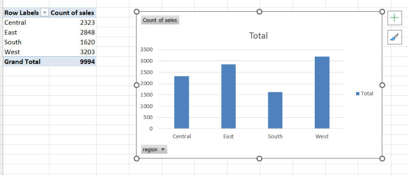
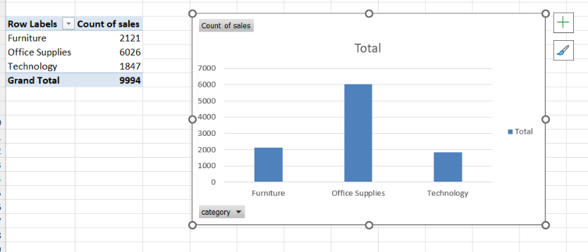
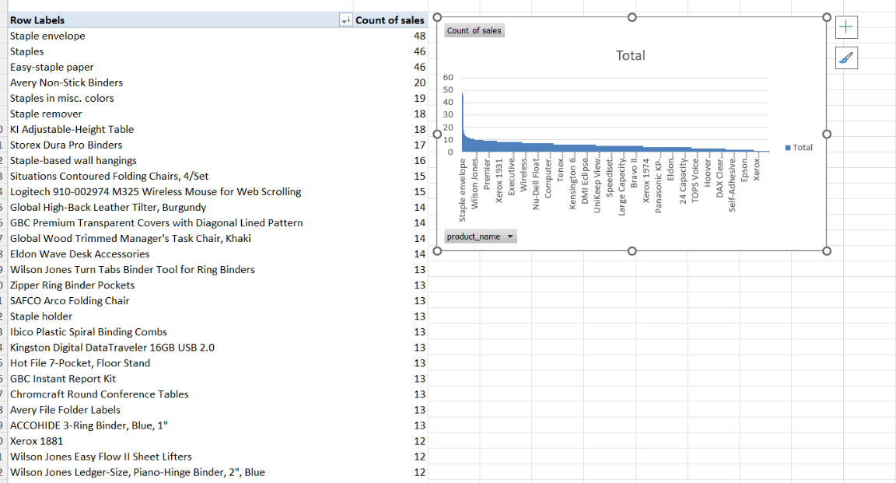
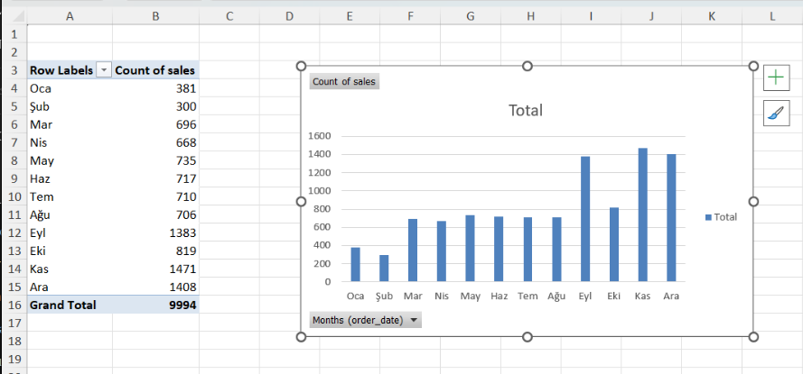

# End-to-End Sales Analytics Project

This project simulates a real-world business scenario where a retail company analyzes sales performance to improve revenue and profitability.

The project follows a full analytics workflow:
- Data exploration (Excel)
- Data modeling & querying (SQL)
- Data analysis (Python)
- Dashboarding (Power BI)

---

## Business Problem

A retail company is facing challenges in understanding its sales performance and needs data-driven insights to:

- which regions drive the most revenue
- which product categories are most profitable
- how sales evolve over time
- which products contribute most to revenue

This project analyzes historical sales data to generate actionable insights that support strategic decision-making and business growth.

Stakeholders need data-driven answers to optimize:
- regional performance
- product strategy
- customer targeting

---

## Business Impact

The insights generated from this analysis can help the company:

- increase revenue by focusing on high-performing regions and products
- improve profitability by identifying low-margin categories
- optimize inventory planning using sales trends
- enhance customer targeting strategies

---

## Dataset

The dataset contains **9,994 retail transactions** from a global superstore.

It includes:

- order and shipping dates
- customer and regional data
- product categories and sub-categories
- sales, quantity, discount, and profit

---

## Project Pipeline

Data → Cleaning → Analysis → Visualization → Business Insights → Recommendations

#### Key Business Questions

- What is the total revenue?
- Which product categories generate the most revenue and profit?
- Which products drive the highest sales?
- How do sales change over time?
- Which customers generate the highest revenue?
- Which states perform best?

#### Business Value

SQL analysis transforms raw transactional data into structured answers that support:

- category performance evaluation  
- customer prioritization  
- product-level decision-making  
- sales trend monitoring  


### 3. Python – Data Processing (upcoming)

### 4. Power BI – Dashboard (upcoming)

### Key Analyses:

- Revenue by Region  
- Revenue by Category  
- Profit by Category  
- Top Products  
- Monthly Sales Trends  

### Visual Results

#### Revenue by Region


#### Revenue by Category


#### Profit by Category


#### Top Products


#### Monthly Sales


---

## Key Insights from Excel Analysis

- Sales are heavily concentrated in specific regions, indicating uneven market performance.
- Technology products generate the highest revenue.
- Profitability varies significantly across categories — not all high-revenue categories are high-profit.
- A small number of products drive a large share of total revenue (Pareto effect).
- Sales trends show clear monthly fluctuations, useful for demand planning.

---

## Business Interpretation

- Focus on high-performing regions to maximize ROI.
- Optimize pricing and costs in low-profit categories.
- Identify and promote top-performing products.
- Use monthly trends for inventory and staffing planning.

---

## Tools Used

- Excel (Pivot Tables, Business Analysis)
- SQL (business query analysis)
- Python (EDA – upcoming)
- Power BI (dashboard – upcoming)

---

## Project Structure
```
end-to-end-sales-analytics
│
├── data
│   └── superstore.csv
│
├── excel
│   └── sales_analysis.xlsx
│
├── sql
│   ├── schema.sql
│   └── analysis.sql
│
├── python
│   └── (coming soon)
│
├── powerbi
│   └── (coming soon)
│
├── images
│   └── excel
│       ├── revenue_by_region.png
│       ├── revenue_by_category.png
│       ├── profit_by_category.png
│       ├── top_products.png
│       └── monthly_sales.png
│
└── README.md
```
---

## Author

Zaur Israfilov  
Aspiring Data Analyst focused on SQL, Python and Business Intelligence
