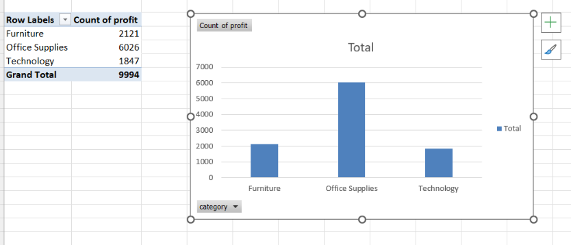

# 📊 End-to-End Sales Analytics

This project demonstrates a complete data analysis workflow from raw data to actionable business insights.

---

## 🚀 Project Overview

The goal of this project is to analyze retail sales data and identify key factors affecting profitability.

The analysis combines:
- Excel (data source)
- SQL (data querying)
- Python (EDA & analysis)
- Power BI (visualization)

---

## 📂 Project Structure

- `/data` → raw dataset
- `/sql` → SQL queries and analysis
- `/python` → data analysis notebooks
- `/images` → visualizations used in reporting
- `/powerbi` → dashboard (if exists)

---

## 🔍 Key Insights

- High discount rates are the primary driver of losses
- Certain regions (e.g., Central) underperform significantly
- Furniture category generates the lowest profit
- A small number of products contribute heavily to total losses

---

## 📈 Sample Visuals

---

## 🛠 Tools Used

- Excel
- SQL
- Python (Pandas, Matplotlib)
- Power BI

---

## 💡 Business Recommendations

- Reduce excessive discounting on high-value products
- Re-evaluate pricing strategy for loss-making items
- Focus on high-performing categories (Technology, Office Supplies)
- Investigate underperforming regions

---

## 📌 Conclusion

This project highlights how data analysis can uncover hidden inefficiencies and support better business decisions.
